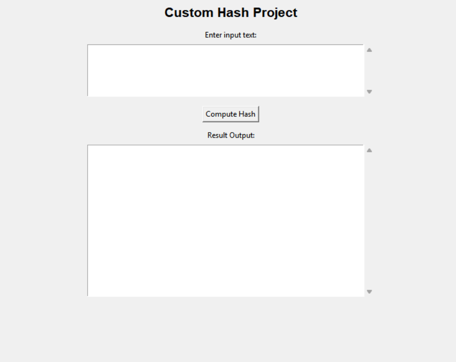
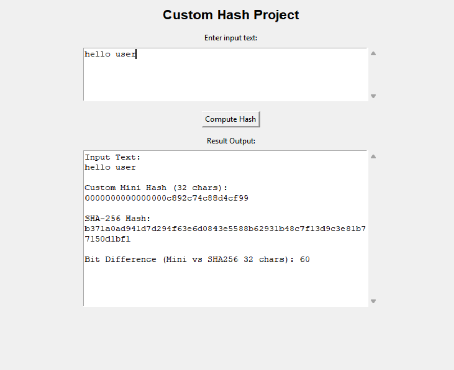
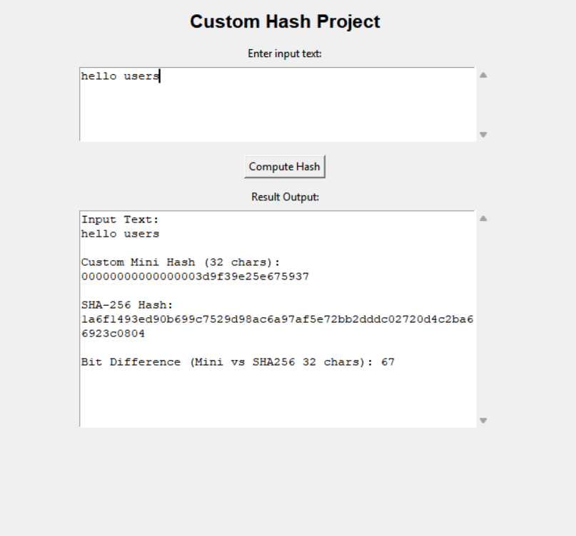

# Custom Hash Algorithm Project
---

## 🔍 Project Overview

This project demonstrates **how hashing works internally** by designing a **custom mini hashing function** and comparing it with the industry standard **SHA-256** hashing algorithm.

The project includes a **Tkinter GUI application** where the user can enter any string input and see:

- Custom 32-character hash output  
- SHA-256 hash output  
- Bit difference calculation (avalanche effect demonstration)

This shows how small input changes result in completely different hash outputs.

---

## 📌 Features Implemented

| Feature | Status |
|---------|--------|
| Custom hashing algorithm (ASCII + shifts + modular + compression) | ✅ |
| Fixed hash size output (32 characters) | ✅ |
| SHA-256 comparison using hashlib | ✅ |
| GUI based user input + hash output | ✅ |
| Avalanche test visualization via bit difference | ✅ |

---

## 🖥 GUI Preview Screenshots





---

## 📁 Project Structure


MiniHash
┣ custom_hash_gui.py
┣ mini_hash_demo.py
┣ README.md
┗ results.txt

````
````

---

## 🚀 Running the GUI

```bash
python custom_hash_gui.py
````

You can enter any string/text and click **Compute Hash**.

---

## 🧠 Avalanche Demonstration Result Example

| Input 1                                       | Input 2                                       | Hash Difference Bits |
| --------------------------------------------- | --------------------------------------------- | -------------------- |
| `abc`                                         | `abc `                                        | 64 bits difference   |
| `The quick brown fox jumps over the lazy dog` | `The quick brown fox jumps over the lazy cog` | 67 bits              |
| `a`                                           | `b`                                           | 63 bits              |

This proves the avalanche property.

---

## 📌 Conclusion

* Custom hash functions can be designed using simple arithmetic + ASCII manipulation + modular operations.
* Even though this custom hash is **NOT cryptographically secure**, it teaches the core idea behind hashing.
* Comparing it with SHA-256 shows how strong cryptographic hashes create huge output differences for tiny input changes.
* This project builds conceptual clarity for hashing fundamentals, diffusion, compression, and the avalanche effect.

---

## 🔗 GitHub Repo

[https://github.com/suv4tha/MiniHash](https://github.com/suv4tha/MiniHash)

```
```
